<style>
    #slideshow div {
        position: relative !important;
    }

    h1 {
        margin-top: 0rem !important;
    }
</style>

# Introduction to Protokit

Building privacy-enabled blockchains using a Typescript zkDSL

**@proto_kit**<br/>
👆 You can find these slides on our twitter

---

# What is Protokit?

<!-- <v-clicks> -->

- Typescript based framework for building zkChains
- Not another zkEVM, uses a **custom-tailored zkVM** instead
- **Hybrid execution model**, both off and on chain
- Off-chain execution = **client side zk-proofs** 🤯
- **End to end proven execution**, no sequencer operator shenanigans
- Customizable and modular (not monolithic 🗿)
- Virtually no learning curve (you should still pay attention tho 👀)

<!-- </v-clicks> -->

---

# What is a zk-proof?

<!-- <v-clicks> -->

- Mathematical **proof of computation[^1] using public or private inputs**
- Might include a public output too
- Computation might include **signature verification, merkle tree inclusion**, and more!
- To compute a proof, **you need a proof system, we use Kimchi**[^2] (same as MINA L1)
- Proof is a **result of circuit execution** - which determine what constraints create a valid proof
- When a circuit is compiled, we get a prover and a verifier/verification key
- **Validity of a proof can be cheaply verified using a verification key**
- Zero-knowledge-ness is achieved by not exposing the private inputs to the verifier

<!-- </v-clicks> -->

[^1]: [Wikipedia: Zero-knowledge proofs](https://en.wikipedia.org/wiki/Zero-knowledge_proof)
[^2]: [Mina book: Kimchi ](https://o1-labs.github.io/proof-systems/specs/kimchi.html)

---

# Meet o1js, zkDSL for writing circuits

```typescript {all|4-5|6-16|8|9-14|10|11|12|13|all} {lines: true}
import { Experimental } from "o1js";

const counter = Experimental.ZkProgram({
    publicInput: Field,
    publicOutput: Field
    methods: {
        add: {
            privateInputs: [UInt64, UInt64],
            method: (publicInput: Field, a: UInt64, b: UInt64): Field => {
                const hash = Poseidon.hash(a.toFields());
                publicInput.assertEquals(hash, "Uh-oh, you're using the wrong number!");
                const incremented = a.add(b);
                return Poseidon.hash(incremented.toFields());
            }
        },
    }
})
```

---

# Running our circuit

```typescript {all|1|3-4|3-6|6-10|6-12} {lines: true}
await counter.compile(); // creates prover & verifier artifacts

const add = UInt64.from(1);
let state = UInt64.from(0);
let publicInput = Poseidon.hash(state.toFields());

const proofOfIncrement = await counter.add(publicInput, state);

// keep track of the state, so we can run counter.add(...) again
publicInput = proofOfIncrement.publicOutput; // h(state + 1)
state = state.add(add); // state + 1

const verified = await counter.verify(proofOfIncrement); // true
```

---

# Power of recursive proofs

```typescript {all|1|1-2|8-18|9|9-17|15|all} {lines: true}
const credential = Experimental.ZkProgram({ ... });
class CredentialProof extends Experimental.ZkProgram.Proof(credential) {}

const counter = Experimental.ZkProgram({
    publicInput: Field,
    publicOutput: Field
    methods: {
        add: {
            privateInputs: [CredentialProof, UInt64, UInt64],
            method: (
                publicInput: Field,
                credentialProof: Proof<Field, Field>,
                a: UInt64,
                b: UInt64
            ): Field => {
                credentialProof.verify(); // yet another computation to prove
                // ... rest of our add() method
            }
        }
    }
})
```

---

# How is this helpful for blockchains?

- Blockchain is effectively a **spicy distributed database with consensus**
- **Nodes execute user transactions** - authorized intent to perform an action on top of the chain data
- **Results of the transactions are bundled into a block**
- Contents of a **block can be verified by re-executing the contents** of it (transactions)
- This approach imposes certain **_(high?)_ hardware requirements, which in turn impacts decentralization**
- MINA's protocol[^1] takes a novel approach, by **turning the aforementioned processes into circuits**
- **Block is now a single recursive block proof 🎉**
- This allows MINA nodes to **verify the computation that resulted into a block(proof) very cheaply**

## [^1]: [Mina protocol architecture](https://docs.minaprotocol.com/about-mina/protocol-architecture)

## layout: cover

# Smart contracts on MINA

## MINA's native L1 smart contracts

# Smart contracts on MINA (1/3)

- Built using o1js's `SmartContract` (also known as zkApps)
- Smart contract is just a **circuit that produces a proof of its own execution**
- **Executed off-chain**, keeps the L1 node hardware requirements to the "minimum"
- Transactions **don't tell the node "what code to execute" anymore**
- Instead a **transaction contains a list of pre-authorized account updates**
- Pre-authorized either by a signature, or a proof
- **Block producer just verifies the signature/proof** and applies account updates to the chain state
- Applying all account updates results into a block proof ✅
- This approach results into **potential race conditions, since users have no built-in way of organizing off-chain**

---

# Smart contracts on MINA (2/3)

```typescript {all} { lines: true }
class Counter extends SmartContract {
  // ⚠️ storage worth of 8 Fields is available (8*256bits total)
  @state(Field) public commitment = State();

  @method()
  public add(a: UInt64, b: UInt64) {
    const hash = Poseidon.hash(a.toFields());
    const commitment = this.commitment.get();
    this.commitment.assertEquals(commitment); // create a precondition

    commitment.assertEquals(hash, "Uh-oh, you're using the wrong number!");

    const incremented = a.add(b);
    const incrementedCommitment = Poseidon.hash(incremented.toFields());

    this.commitment.set(incrementedCommitment); // update the on-chain state
  }
}
```

---

# Smart contracts on MINA (3/3)

```typescript {all} { lines: true }
const counter = new Counter(address);

// create account updates for the transaction, by executing the contract code
const tx = Mina.transaction(feePayer, () => {
  counter.add(UInt64.from(1));
});
// account updates:
// [{ address, preconditions: [commitment], state: [incrementedCommitment] authorization: proof }]

// prove the code execution
await tx.prove();

// send it to the node/mempool
await tx.send();
```

---

# Smart contracts on MINA (4/4)


---

# ERC-20-like contract and public state

**Map-like storage is not possible with the L1 smart contracts** out of the box:

```typescript {all} { lines: true}
class ERC20 extends SmartContract {
  // ❌ this is NOT possible with the L1 smart contract
  @state(PublicKey, UInt64) public ledger = State();

  @method()
  transfer(from: PublicKey, to: PublicKey, amount: UInt64) {}
}
```

You can **store a commitment to a merkle tree's root hash** instead:

```typescript {all} { lines: true}
class ERC20 extends SmartContract {
  // ✅ this is possible with the L1 smart contract
  @state(Field) public ledgerCommitment = State();

  @method()
  transfer(from: PublicKey, to: PublicKey, amount: UInt64) {}
}
```

---

# What is a merkle tree?


**blue** = provided by a witness,
**red** = provided by you,
**green** = computed by you

TL;DR; a data structure that allows us to **cryptographically verify <br/> that a leaf/node is a part of a tree**,
by computing the root hash using a merkle witness.

---

# Reading tree data

```typescript {all} { lines: true}
class ERC20 extends SmartContract {
    @state(Field) public ledgerCommitment = State();

    @method()
    transfer(from: PublicKey, to: PublicKey, amount: UInt64) {
        const ledgerCommitment = this.ledgerCommitment.get();
        this.ledgerCommitment.assertEquals(); // precondition to ledgerCommitment

        const fromKey = toField(PublicKey, from); // returns h(from)
        const fromBalance = getBalance(fromKey); // returns a MerkleMapWitness

        const toKey = toField(PublicKey, to);
        const toBalance = getBalance(toKey);

        const [computedLedgerCommitment, computedKey] = from.computeRootAndKey(toField(UInt64, fromBalance));

        // check if the provided data is valid, by checkin if its part of the tree
        ledgerCommitment.assertEquals(computedLedgerCommitment, "Uh-oh, invalid root hash!");
        fromKey.assertEquals(computedKey, "Uh-oh, invalid key!");

        // ... rest of the transfer logic
    }

```

---

# Updating tree data

```typescript {all} { lines: true}
class ERC20 extends SmartContract {
    // ✅ this is possible with the L1 smart contract
    @state(Field) public ledgerCommitment = State();

    @method()
    transfer(from: PublicKey, to: PublicKey, amount: UInt64) {
        // ... our prior transfer logic is here

        const newFromBalance = fromBalance.sub(amount);
        // compute a new tree root hash, using the new balance as a leaf value
        const [newLedgerCommitment] = from.computeRootAndKey(toField(UInt64, newFrombalance));

        // update the on-chain commitment
        this.ledgerCommitment.set(newLedgerCommitment);

        // ... rest of the transfer logic
    }

```

---

# Design limitations

- Users **execute smart contracts on the client side**, independently of other clients
- This **leads to preconditions pointing to the root hash of the tree**
- If there are **two users transfering at the same time, their preconditions will be the same**
- After **one transaction succeeds, the on-chain state is updated** (commitment changes)
- This **invalidates the second transaction, since it now has an outdated precondition**


---

## layout: cover

# Protokit

Protocol development framework for privacy enabled application chains.

---

# Build your own zkRollup

- Protokit enables developers to **build zero-knowledge, interoperable and privacy preserving application chains** with a minimal learning curve.
- You can **roll your own zkRollup** in a few lines of code.
- **zkRollups are a superset of zkApps**, combining **opt-in privacy features with on-chain execution** for the best-in-class user experience.

### What is a Protokit zkRollup made of?

- **Runtime** = application logic
- **Protocol** = underlying VM, block production, transaction fees, account state, ...
- **Sequencer** = mempool, block production, settlement to L1

## 👆 You can replace any module of your app-chain, want a different mempool implementation? Just write one!

# Features

- 🔌 Supercharged developer experience, it's just Typescript (and a little bit of o1js)
- 📚 Reusable modules, found an open-source module you like? `npm install <module-name>`
- 🏎️ No data race conditions, thanks to sequenced transactions (throughput goes brrr)
- 💽 "Bottomless" on-chain storage, including a key-value storage (`State/StateMap`)
- 🥷 Preserved privacy using off-chain proofs as arguments for on-chain transactions
- 🏗️ Focus on business logic, we've done the heavy lifting for you. (looking at you, merkle trees 🌴)
- 💳 Integrated with user wallets, thanks to `mina-signer`
- 🤯 Not another zkEVM, but a succinct zkVM instead

<br/>

**soon™️:**

- 🌉 Interoperable with L1s and other L2s (with varying degrees of security guarantees)
- 🧺 Data availability (don't tell anyone just yet)

---

# Protokit architecture (simplified)

```mermaid
flowchart BT
    subgraph zkRollup
        direction LR
        sequencer

        subgraph runtime["runtime (on-chain execution)"]
            method["balances.transfer(proof?, ...)"]
            stateTransitions["state transitions \n (of the merkle tree)"]
        end

        sequencer -- executes transaction --> runtime
        method -- produces --> stateTransitions
        stateTransitions -- applied by --> protocol
        protocol --> blockProof
    end



    subgraph client
        direction LR
        alice

        subgraph transaction
            runtimeMethod["balances.transfer(proof?, ...)"]
        end

       subgraph circuit["circuit, e.g. zkKYC"]
            direction LR
            circuitMethod["hasKYC()"]
            proof["proof"]

            circuitMethod --> proof
        end

        circuit -- (optional) proof as runtime argument --> transaction
        alice -- create --> transaction
        transaction -- nothing to prove here 👀 --> sign["sign()"]
        sign --> send["send()"]
    end

    client -- submit transaction --> zkRollup
```



---

# Writing your own runtime

```typescript {all} { lines: true }
@runtimeModule()
class Balances extends RuntimeModule<unknown> {
  // "unlimited" on-chain state
  @state() public balances = StateMap.from(PublicKey, UInt64);

  // on-chain executed business logic
  @runtimeMethod()
  public transfer(from: PublicKey, to: PublicKey, amount: UInt64) {
    const fromBalance = this.balances.get(from); // produces a state transition
    const toBalance = this.balances.get(to);

    const fromBalanceIsSufficient = fromBalance.greaterThanOrEqual(amount);

    assert(fromBalanceIsSufficient, errors.fromBalanceInsufficient()); // soft-fails circuit execution

    const newFromBalance = fromBalance.sub(amount);

    this.balances.set(newFromBalance); // produces a state transition

    // ... rest of the transfer logic
  }
}
```

---

# Testing your runtime

```typescript {all} { lines: true }
const alicePrivateKey = PrivateKey.random();
const alicePublicKey = alicePrivateKey.toPublicKey();

const bobPrivateKey = PrivateKey.random();
const bobPublicKey = bobPrivateKey.toPublicKey();

const appChain = TestingAppChain.fromRuntime({
  modules: {
    Balances,
  },
  config: {
    Balances: {},
  },
});

await appChain.start();
appChain.setSigner(alicePrivateKey);
```

---

# Executing transactions

```typescript {all} { lines: true }
const balances = appChain.runtime.resolve("Balances");
const tx = appChain.transaction(alicePublicKey, () => {
  balances.transfer(alice, bob, UInt64.from(100));
});

await tx.sign();
await tx.send();

await appChain.produceBlock();

const bobBalance =
  await appChain.query.runtime.Balances.balances.get(bobPublicKey);
// ^ UInt64 = 100, assuming we minted sufficient balance for Alice before (not shown)
```

---

# transaction lifecycle

---

## layout: cover

# Start building using the starter-kit

```bash {all}
$ npx degit proto-kit/starter-kit#develop my-app-chain
```

# Examples of runtime usage

- injecting other runtime modules

# Modularity examples

- query api modularization
- in memory signer / auro signer

# Protocol module examples

- tx fee
- account state

# What to expect in the future

---

# how to build a private airdrop runtime
