```mermaid
flowchart BT
    subgraph zkRollup
        direction LR
        sequencer

        subgraph runtime["runtime (on-chain execution)"]
            method["balances.transfer(proof?, ...)"]
            stateTransitions["state transitions \n (of the merkle tree)"]
        end

        sequencer -- executes transaction --> runtime
        method -- produces --> stateTransitions
        stateTransitions -- applied by --> protocol
        protocol --> blockProof
    end

    subgraph L1["MINA L1"]
        settlementContract["Settlement smart contract"]
    end

    subgraph client
        direction LR
        alice

        subgraph transaction
            runtimeMethod["balances.transfer(proof?, ...)"]
        end

       subgraph circuit["circuit, e.g. zkKYC"]
            direction LR
            circuitMethod["hasKYC()"]
            proof["proof"]

            circuitMethod --> proof
        end

        circuit -- (optional) proof as runtime argument --> transaction
        alice -- create --> transaction
        transaction -- nothing to prove here 👀 --> sign["sign()"]
        sign --> send["send()"]
    end

    client -- submit transaction --> zkRollup

    zkRollup -- settles block proof --> L1
```

<style>
    #slideshow div {
        position: relative !important;
    }

    h1 {
        margin-top: 0rem !important;
    }


    *::selection {
        color: inherit !important;
        background-color: rgba(0,0,0,0.5) !important;
    }
</style>

# Introduction to Protokit

Building privacy-enabled blockchains using a Typescript zkDSL

<small>

**@proto_kit**<br/>
👆 Follow our twitter for latest updates

**https://discord.gg/pddYkUgwYg**<br/>
👆 Join our discord to keep up with our development

**https://protokit.dev/**<br/>
👆 Visit our website for more information (or less)

</small>

---
layout: cover
---

# From zero to zkHero
All you need to know to start building with zk!

---

# What is a zk-proof?

<v-clicks>

- Mathematical **proof of computation[^1] using public or private inputs**
- Might include a public output too
- Computation might include **signature verification, merkle tree inclusion**, and more!
- To compute a proof, **you need a proof system, we use Kimchi**[^2] (same as MINA L1)
- Proof is a **result of circuit execution** - which determine what constraints create a valid proof
- When a circuit is compiled, we get a prover and a verifier/verification key
- **Validity of a proof can be cheaply verified using a verification key**
- Zero-knowledge-ness is achieved by not exposing the private inputs to the verifier

</v-clicks>

[^1]: [Wikipedia: Zero-knowledge proofs](https://en.wikipedia.org/wiki/Zero-knowledge_proof)
[^2]: [Mina book: Kimchi ](https://o1-labs.github.io/proof-systems/specs/kimchi.html)

---

# Meet o1js, zkDSL for writing circuits

```typescript {all} {lines: true}
import { Experimental } from "o1js";

const counter = Experimental.ZkProgram({
    publicInput: Field,
    publicOutput: Field
    methods: {
        increment: {
            privateInputs: [UInt64, UInt64],
            method: (publicInput: Field, a: UInt64, b: UInt64): Field => {
                const hash = Poseidon.hash(a.toFields());
                publicInput.assertEquals(hash, "Uh-oh, you're using the wrong number!");
                const incremented = a.add(b);
                return Poseidon.hash(incremented.toFields());
            }
        },
    }
})
```

---

# Running our circuit

```typescript {all} {lines: true}
await counter.compile(); // creates prover & verifier artifacts

let state = UInt64.from(0);
let publicInput = Poseidon.hash(state.toFields());
const by = UInt64.from(1);

const proofOfIncrement = await counter.increment(publicInput, state, by);

// keep track of the state, so we can run counter.increment(...) again
publicInput = proofOfIncrement.publicOutput; // h(state + 1)
state = state.add(by); // state + 1

const verified = await counter.verify(proofOfIncrement); // true
```

---

# Power of recursive proofs

```typescript {all} {lines: true}
const credential = Experimental.ZkProgram({ ... });
class CredentialProof extends Experimental.ZkProgram.Proof(credential) {}

const counter = Experimental.ZkProgram({
    publicInput: Field,
    publicOutput: Field
    methods: {
        add: {
            privateInputs: [CredentialProof, UInt64, UInt64],
            method: (
                publicInput: Field,
                credentialProof: Proof<Field, Field>,
                a: UInt64,
                b: UInt64
            ): Field => {
                credentialProof.verify(); // yet another computation to prove
                // ... rest of our add() method
            }
        }
    }
})
```

---

# How is this helpful for blockchains?

<v-clicks>

- Blockchain is effectively a **spicy distributed database with consensus**
- **Nodes execute user transactions** - authorized intent to perform an action on top of the chain data
- **Results of the transactions are bundled into a block**
- Contents of a **block can be verified by re-executing the contents** of it (transactions)
- This approach imposes certain **_(high?)_ hardware requirements, which in turn impacts decentralization**
- MINA's protocol[^1] takes a novel approach, by **turning the aforementioned processes into circuits**
- **Block is now a single recursive block proof 🎉**
- This allows MINA nodes to **verify the computation that resulted into a block(proof) very cheaply**
</v-clicks>

[^1]: [Mina protocol architecture](https://docs.minaprotocol.com/about-mina/protocol-architecture)

---
layout: cover
---

# MINA's native L1 smart contracts

---

# Smart contracts on MINA (1/3)

<v-clicks>

- Built using o1js's `SmartContract` (also known as zkApps)
- Smart contract is just a **circuit that produces a proof of its own execution**
- **Executed off-chain**, keeps the L1 node hardware requirements to the "minimum"
- Transactions **don't tell the node "what code to execute" anymore**
- Instead a **transaction contains a list of pre-authorized account updates**
- Pre-authorized either by a signature, or a proof
- **Block producer just verifies the signature/proof** and applies account updates to the chain state
- Applying all account updates results into a block proof ✅
- This approach results into **potential race conditions, since users have no built-in way of organizing off-chain**

</v-clicks>

---

# Smart contracts on MINA (2/3)

```typescript {all} { lines: true }
class Counter extends SmartContract {
  // ⚠️ storage worth of 8 Fields is available (8*256bits total)
  @state(Field) public commitment = State();

  @method()
  public increment(a: UInt64, b: UInt64) {
    const hash = Poseidon.hash(a.toFields());
    const commitment = this.commitment.get();
    this.commitment.assertEquals(commitment); // create a precondition

    commitment.assertEquals(hash, "Uh-oh, you're using the wrong number!");

    const incremented = a.add(b);
    const incrementedCommitment = Poseidon.hash(incremented.toFields());

    this.commitment.set(incrementedCommitment); // update the on-chain state
  }
}
```

---

# Smart contracts on MINA (3/3)

```typescript {all} { lines: true }
const counter = new Counter(address);

// create account updates for the transaction, by executing the contract code
const tx = Mina.transaction(feePayer, () => {
  counter.increment(UInt64.from(1));
});
// account updates:
// [{ address, preconditions: [commitment], state: [incrementedCommitment] authorization: proof }]

// prove the code execution
await tx.prove();

// send it to the node/mempool
await tx.send();
```

---

# Smart contracts on MINA (4/4)


---

# Key-value storage in smart contracts

<v-clicks>

<div>

**Map-like storage is not possible with the L1 smart contracts** out of the box:

```typescript {all} { lines: true}
class Counters extends SmartContract {
  // ❌ this is NOT possible with the L1 smart contract
  @state(PublicKey, UInt64) public counters = State();

  @method()
  increment(for: PublicKey, by: UInt64) {}
}
```

</div>


<div>

You can **store a commitment to a merkle tree's root hash** instead:

```typescript {all} { lines: true}
class Counters extends SmartContract {
  // ✅ this is possible with the L1 smart contract
  @state(Field) public countersCommitment = State();

  @method()
  increment(for: PublicKey, by: UInt64) {}
}
```

</div>

</v-clicks>

---

# What is a merkle tree?


**blue** = provided by a witness,
**red** = provided by you,
**green** = computed by you

TL;DR; a data structure that allows us to **cryptographically verify <br/> that a leaf/node is a part of a tree**,
by computing the root hash using a merkle witness.

---

# MerkleMap to the rescue

<v-clicks>

- Merkle tree leafs can be identified by an index
- If you use a merkle tree with a _depth_ of 256 (size), it means there's 2^256 leafs
- This means the leaf index ranges from 0-2^256, threfore can be repesented by a single field
- You can now think of a tree like of a key-value storage, where key = field, value = field, root = field
- This key-value API is called MerkleMap

</v-clicks>
<v-clicks>

```typescript {all} { lines: true }
const map = new MerkleMap();
const key = Poseidon.hash(PrivateKey.random().toPublicKey().toFields()) // Field
const value = Poseidon.hash(UInt64.from(1000).toFields()); // Field

// store a hash of values in the tree
map.set(key, value);

const witness = map.getWitness(key); // MerkleMapWitness
const [computedRoot, computedKey] = witness.computeRootAndKey(value); // [Field, Field]
```

</v-clicks>

---

# Reading tree data

```typescript {all} { lines: true}
class Counters extends SmartContract {
    @state(Field) public countersCommitment = State();

    @method()
    increment(for: PublicKey, by: UInt64) {
        const countersCommitment = this.countersCommitment.get();
        this.countersCommitment.assertEquals(); // precondition to countersCommitment

        const forKey = toField(for); // returns h(for)
        const [forCounter, forCounterWitness] = getCounter(forKey); // returns [UInt64, MerkleMapWitness]

        const [computedCountersCommitment, computedForKey] = 
            forCounterWitness.computeRootAndKey(toField(forCounter));

        // check if the provided data is valid, by checking if its part of the tree
        countersCommitment.assertEquals(countersCommitment, "Uh-oh, invalid root hash!");
        forKey.assertEquals(computedForKey, "Uh-oh, invalid key!");

        // ... rest of the increment logic
    }

```

---

# Updating tree data

```typescript {all} { lines: true}
class Counters extends SmartContract {
    @state(Field) public countersCommitment = State();

    @method()
    increment(for: PublicKey, by: UInt64) {
        // ... our prior increment logic is here

        const newForCounter = forCounter.add(by);
        // compute a new tree root hash, using the new balance as a leaf value
        const [newCountersCommitment] = forCounterWitness.computeRootAndKey(toField(newForCounter));

        // update the on-chain commitment
        this.countersCommitment.set(newCountersCommitment);

        // ... rest of the increment logic
    }

```

---

# Design limitations

<v-clicks>

- Users **execute smart contracts on the client side**, independently of other clients
- This **leads to preconditions pointing to the root hash of the tree**
- If there are **two users transfering at the same time, their preconditions will be the same**
- After **one transaction succeeds, the on-chain state is updated** (commitment changes)
- This **invalidates the second transaction, since it now has an outdated precondition**

</v-clicks>

<v-clicks>


</v-clicks>

---
layout: cover
---

# Building a private airdrop <br/> on MINA

---

# Architecture

<v-clicks>

- **Airdrop merkle tree**, stores all addresses eligible for airdrop
- Everyone receives the same amount of tokens from the airdrop
- **Airdrop smart contract**, that tokens can be claimed from only if **the user can prove they are part of the airdrop tree**
- In order to prevent double-claims, we must also **use a cryptographically sound nullifier** that **can't be traced back to the user's address**.

</v-clicks>

---

# Smart Contract (1/2)

```typescript {all} { lines: true }
class Airdrop extends SmartContract {
    @state(Field) public airdropTreeCommitment = State()
    @state(Field) public nullifierTreeCommitment = State()

    @method()
    public claim(airdropWitness: MerkleMapWitness, nullifier: Nullifier, nullifierWitness: MerkleMapWitness) {
        const airdropTreeCommitment = this.airdropTreeCommitment.getAndAssertEquals();
        const nullifierTreeCommitment = this.nullifierTreeCommitment.getAndAssertEquals();

        // check if user is part of the airdrop
        const [computedAirdropTreeCommitment, computedAirdropKey] = airdropWitness.computeRootAndKey(
            Bool(true).toField()    
        );

        nullifier.verify(message); // message needs to be a constant in your contract .e.g [Field(0)]

        airdropTreeCommitment.assertEquals(computedAirdropTreeCommitment)
        computedAirdropKey.assertEquals(Poseidon.hash(nullifier.getPublicKey().toFields()))

        // ... rest of the claim logic
    }
}
```

---

# Smart Contract (2/2)

```typescript {all} { lines: true }
class Airdrop extends SmartContract {
    @method()
    public claim(airdropWitness: MerkleMapWitness, nullifier: Nullifier, nullifierWitness: MerkleMapWitness) {
        // ... earlier claim logic
        
        // check the nullifier has not been yet used
        const [computedNullifierTreeCommitment, computedNullifierKey] = nullifierWitness.computeRootAndKey(
            Field(0)  
        );

        nullifierTreeCommitment.assertEquals(computedNullifierTreeCommitment)
        nullifier.key().assertEquals(computedNullifierKey)

        const [updatedNullifierTreeCommitment] = nullifierWitness.computeRootAndKey(
            Bool(true).toField() 
        );

        this.nullifierTreeCommitment.set(updatedNullifierTreeCommitment);
        // airdrop the tokens
        this.send({ to: this.sender, amount: UInt64.from(1000) });
    }
}
```

---
layout: cover
---

# Protokit

Protocol development framework for privacy enabled application chains <br/>(a.k.a. zkRollups)

```bash {all}
$ npx degit proto-kit/starter-kit#develop my-app-chain
```

---

# What is Protokit?

<v-clicks>

- Typescript based framework for building zkChains
- Not another zkEVM, uses a **custom-tailored zkVM** instead
- **Hybrid execution model**, both off and on chain
- Off-chain execution = **client side zk-proofs** 🤯
- **End to end proven execution**, no sequencer operator shenanigans
- Customizable and modular (not monolithic 🗿)
- Virtually no learning curve (you should still pay attention tho 👀)

</v-clicks>

---

# Build your own zkRollup

<v-clicks>

- **Recursive zk-rollup is a series of recursive circuits**, that prove transaction execution and rollup state transitions
- **L1 offers _sequence state_ and _actions_** to help you build zk-rollups, but **you still have to write your own circuits!**
- Protokit enables developers to **build zero-knowledge, interoperable and privacy preserving application chains** with a minimal learning curve.
- You can **roll your own zkRollup** in a few lines of code.
- **zkRollups are a superset of zkApps**, combining **opt-in privacy features with on-chain execution** for the best-in-class user experience.

</v-clicks>

<v-clicks>

### What is a Protokit zkRollup made of?

</v-clicks>

<v-clicks>

- **Runtime** = application logic
- **Protocol** = underlying VM, block production, transaction fees, account state, ...
- **Sequencer** = mempool, block production, settlement to L1
- **L1 settlement contract** - an L1 contract validating your rollup's block proofs

</v-clicks>
<v-clicks>

👆 You can replace any module of your app-chain, want a different mempool implementation? Just write one!

</v-clicks>

---

# Features

<v-clicks>

- 🔌 Supercharged developer experience, it's just Typescript (and a little bit of o1js)
- 📚 Reusable modules, found an open-source module you like? `npm install <module-name>`
- 🏎️ No data race conditions, thanks to sequenced transactions (throughput goes brrr)
- 💽 "Bottomless" on-chain storage, including a key-value storage (`State/StateMap`)
- 🥷 Preserved privacy using off-chain proofs as arguments for on-chain transactions
- 🏗️ Focus on business logic, we've done the heavy lifting for you. (looking at you, merkle trees 🌴)
- 💳 Integrated with user wallets, thanks to `mina-signer`
- 🤯 Not another zkEVM, but a succinct zkVM instead
- 🤓 You can implement the entire zkApps MIP if you want, or just customize the runtime to fit your needs
- 👑 Iterate your on-chain logic faster than with the L1, feature is king

</v-clicks>

<v-clicks>

**soon™️:**

- 🌉 Interoperable with L1s and other L2s (with varying degrees of security guarantees)
- 🧺 Data availability (don't tell anyone just yet)

</v-clicks>

---




---

# Writing your own runtime

```typescript {all} { lines: true }
@runtimeModule()
class Balances extends RuntimeModule<unknown> {
  // "unlimited" on-chain state
  @state() public balances = StateMap.from(PublicKey, UInt64);

  // on-chain executed business logic
  @runtimeMethod()
  public transfer(from: PublicKey, to: PublicKey, amount: UInt64) {
    const fromBalance = this.balances.get(from); // produces a state transition
    const toBalance = this.balances.get(to);

    const fromBalanceIsSufficient = fromBalance.greaterThanOrEqual(amount);

    assert(fromBalanceIsSufficient, errors.fromBalanceInsufficient()); // soft-fails circuit execution

    const newFromBalance = fromBalance.sub(amount);

    this.balances.set(from, newFromBalance); // produces a state transition

    // ... rest of the transfer logic
  }
}
```

---

# Testing your runtime

```typescript {all} { lines: true }
const alicePrivateKey = PrivateKey.random();
const alicePublicKey = alicePrivateKey.toPublicKey();

const bobPrivateKey = PrivateKey.random();
const bobPublicKey = bobPrivateKey.toPublicKey();

const appChain = TestingAppChain.fromRuntime({
  modules: {
    Balances,
  },
  config: {
    Balances: {},
  },
});

await appChain.start();
appChain.setSigner(alicePrivateKey);
```

---

# Executing transactions

```typescript {all} { lines: true }
const balances = appChain.runtime.resolve("Balances");
const tx = appChain.transaction(alicePublicKey, () => {
  balances.transfer(alice, bob, UInt64.from(100));
});

await tx.sign();
await tx.send();

await appChain.produceBlock();

const bobBalance =
  await appChain.query.runtime.Balances.balances.get(bobPublicKey);
// ^ UInt64 = 100, assuming we minted sufficient balance for Alice before (not shown)
```

---
layout: cover
---

# Building a private airdrop runtime


```bash {all}
$ npx degit proto-kit/starter-kit#develop private-airdrop
```

---

# Additional content

- Examples of runtime usage
- Modularity examples
- Query api modularization
- In memory signer / Auro signer
- Protocol module examples
- tx fees
- Account state
- What to expect in the future
